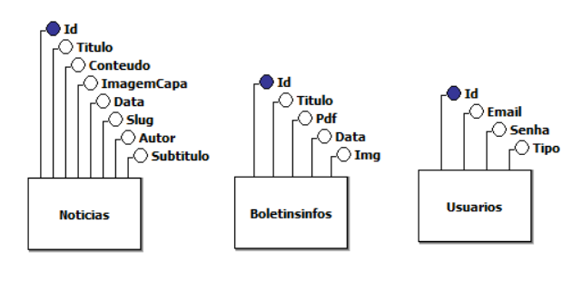

# DOCUMENTAÇÃO DA APLICAÇÃO WEB

### CENTRO PAULA SOUZA - FACULDADE DE TECNOLOGIA DE JAHU  

### CURSO DE TECNOLOGIA EM DESENVOLVIMENTO DE SOFTWARE MULTIPLATAFORMA  

**Jahu, SP**

**Início: 3º semestre/2026**

**Autores:** 

 - [Lucas Gabriel de Paula Pinto](https://www.linkedin.com/in/lucas-gabriel-de-paula-pinto-065734241/)

---

# 0. SUMÁRIO  

1. [RESUMO DA APLICAÇÃO WEB](#1-resumo-da-aplicação-web)  
2. [OBJETIVO](#2-objetivo)  
3. [MÉTODOS DA PESQUISA](#3-métodos-da-pesquisa)  
4. [DOCUMENTO DE REQUISITOS](#4-documento-de-requisitos)
   - [Requisitos funcionais](#41-requisitos-funcionais)
   - [Requisitos não funcionais](#42-requisitos-não-funcionais)
5. [REGRAS DE NEGÓCIO](#5-regras-de-negócio)  
6. [ESTUDO DE VIABILIDADE](#6---estudo-de-viabilidade)  
   - [Viabilidade Técnica](#61-viabilidade-técnica)  
   - [Viabilidade Econômica](#62-viabilidade-econômica)  
   - [Viabilidade Operacional](#63-viabilidade-operacional)  
   - [Viabilidade de Mercado](#64-viabilidade-de-mercado)  
7. [MODELO DE DADOS](#7-modelo-de-dados)  
   - [Modelo de Caso de Uso](#71-modelo-de-caso-de-uso)  
   - [Modelo Conceitual](#72-modelo-conceitual)  
   - [Modelo Lógico](#73-modelo-lógico)  
8. [DESIGN](#8-design)  
9. [PROTÓTIPO](#9-protótipo)  
10. [APLICAÇÃO](#10-aplicação)  
11. [CONSIDERAÇÕES FINAIS](#11-considerações-finais)  
12. [REFERÊNCIAS BIBLIOGRÁFICAS](#12-referências-bibliográficas)  

---

## 1. RESUMO DA APLICAÇÃO WEB 
A aplicação é um sistema web desenvolvido para a gestão e divulgação de conteúdos da paróquia.
Ela permite o cadastro, edição e exibição de notícias com texto rico, imagens e organização por data.
Também inclui uma área de boletins informativos com acesso a imagens e arquivos em PDF.
O projeto possui um painel administrativo para facilitar a criação e gerenciamento do conteúdo.
Além disso, conta com uma página de contato com envio de mensagens diretamente para o e-mail da paróquia.

---

## 2. OBJETIVO  
- Facilitar a comunicação da paróquia com a comunidade

- Centralizar notícias e boletins em um único sistema

- Permitir atualização de conteúdo de forma simples e organizada

- Melhorar a experiência dos usuários ao acessar informações da paróquia

- Digitalizar e modernizar a divulgação de eventos e comunicados

---

## 3. MÉTODOS DA PESQUISA  
 
O desenvolvimento deste projeto foi conduzido a partir de uma abordagem prática e aplicada, com foco na resolução de uma necessidade real da paróquia: melhorar a comunicação com a comunidade por meio de uma plataforma digital. Inicialmente, foi realizado o levantamento de requisitos, identificando as principais funcionalidades desejadas, como a publicação de notícias, disponibilização de boletins informativos e criação de um canal de contato direto com os fiéis.

Em seguida, foi feita uma análise teórica envolvendo conceitos de desenvolvimento web, incluindo arquitetura cliente-servidor, APIs REST e organização de banco de dados. Também foram estudados exemplos de sites institucionais e portais de notícias para compreender boas práticas de design, usabilidade e organização de conteúdo.

Com base nessas informações, foi realizada a modelagem do sistema, definindo as entidades principais e a estrutura de funcionamento da aplicação. Foram elaborados protótipos das telas para visualizar a navegação e a disposição dos elementos, facilitando a tomada de decisões antes da implementação.

A etapa de desenvolvimento foi realizada utilizando tecnologias modernas, com React no front-end e C# com ASP.NET no back-end. Foram implementadas funcionalidades como cadastro de notícias com editor de texto rico, upload de imagens, organização de arquivos e integração com banco de dados.

Por fim, foram realizados testes para validar o funcionamento da aplicação, identificando possíveis falhas e realizando ajustes necessários. A validação incluiu a verificação das funcionalidades principais e a análise da experiência do usuário, garantindo que o sistema atendesse aos objetivos propostos.

 

### 3.1 Levantamento de Requisitos 

Nesta etapa foram identificadas as necessidades da paróquia em relação à comunicação com a comunidade. Foram levantadas as principais funcionalidades desejadas, como a publicação de notícias, disponibilização de boletins informativos e criação de um canal de contato. Também foram considerados aspectos de usabilidade e facilidade de manutenção, visando permitir que pessoas sem conhecimento técnico possam utilizar o sistema.

### 3.2 Análise e estudo Teórico 

Foi realizado um estudo sobre desenvolvimento de aplicações web modernas, abordando conceitos como front-end e back-end, APIs REST e bancos de dados. Também foram analisadas referências de sites institucionais, como portais de notícias religiosas, para entender padrões de layout, organização de conteúdo e experiência do usuário.
 

### 3.3 Modelagem e prototipagem  

A estrutura do sistema foi planejada por meio da definição das entidades principais, como notícias e boletins informativos. Também foram elaborados protótipos de telas para visualizar a organização das páginas, incluindo a listagem de notícias, página de detalhes e área administrativa. Essa etapa ajudou a definir a navegação e o design antes do desenvolvimento.

### 3.4 Desenvolvimento da aplicação 

A aplicação foi desenvolvida utilizando React no front-end e C# com ASP.NET no back-end. Foram implementadas funcionalidades como cadastro de notícias com editor de texto rico, upload de imagens, geração de URLs amigáveis (slug) e exibição dinâmica dos conteúdos. Também foi criada a integração com o banco de dados para armazenar e recuperar as informações.

### 3.5 Teste e validação

Foram realizados testes para verificar o funcionamento das funcionalidades, como criação de notícias, exibição de conteúdos e acesso aos boletins. Também foram feitos ajustes com base em feedbacks recebidos, especialmente em relação ao design e organização das páginas. A validação garantiu que o sistema atende às necessidades propostas.

 ---

## 4. DOCUMENTO DE REQUISITOS  

O documento de requisitos tem como objetivo descrever de forma detalhada as funcionalidades e características que o sistema deve possuir, servindo como base para o desenvolvimento da aplicação. Por meio dele, é possível garantir que todas as necessidades levantadas na fase inicial do projeto sejam atendidas de maneira organizada e coerente.

Neste projeto, os requisitos foram divididos em funcionais e não funcionais. Os requisitos funcionais descrevem as ações e operações que o sistema deve executar, como o cadastro e exibição de notícias e boletins informativos. Já os requisitos não funcionais definem critérios de qualidade, como desempenho, usabilidade, compatibilidade e organização do sistema.

A definição desses requisitos contribuiu para uma melhor organização do desenvolvimento, evitando retrabalho e facilitando a validação final da aplicação.

### 4.1 Requisitos funcionais  
- 4.1.1 RF1 - Cadastrar notícias
- 4.1.2 RF2 - Editar e excluir notícias
- 4.1.3 RF3 - Exibir lista de notícias
- 4.1.4 RF4 - Visualizar notícia completa
- 4.1.5 RF5 - Fazer upload de imagens para notícias
- 4.1.6 RF6 - Gerar URL amigável (slug) para notícias
- 4.1.7 RF7 - Cadastrar boletins informativos
- 4.1.8 RF8 - Exibir boletins informativos
- 4.1.9 RF9 - Permitir download de boletins em PDF
- 4.1.10 RF10 - Realizar busca de boletins por mês ou ano
- 4.1.11 RF11 - Exibir imagens dentro do conteúdo da notícia
- 4.1.12 RF12 - Enviar mensagens pela página de contato

### 4.2 Requisitos não funcionais  
- 4.2.1 RNF1 - O sistema deve possuir interface simples e intuitiva
- 4.2.2 RNF2 - O tempo de carregamento das páginas deve ser rápido
- 4.2.3 RNF3 - A aplicação deve ser responsiva, adaptando-se a diferentes dispositivos
- 4.2.4 RNF4 - O sistema deve manter organização adequada dos arquivos (imagens e PDFs)
- 4.2.5 RNF5 - O código deve ser estruturado para facilitar manutenção e evolução
- 4.2.6 RNF6 - A aplicação deve ser compatível com os principais navegadores
- 4.2.7 RNF7 - O sistema deve garantir integridade e consistência dos dados armazenados

---

## 5. MODELO DE NEGÓCIO  

---

## 6. ESTUDO DE VIABILIDADE  

O estudo de viabilidade tem como finalidade analisar se o desenvolvimento do sistema é possível e adequado, considerando aspectos técnicos, financeiros, operacionais e de mercado. Essa análise permite identificar riscos, benefícios e a relevância do projeto antes e durante sua execução.

### 6.1 viabilidade técnica

A viabilidade técnica do projeto é considerada alta, pois as tecnologias utilizadas, como React no front-end e C# com ASP.NET no back-end, são amplamente utilizadas e bem documentadas. O desenvolvimento foi realizado com ferramentas acessíveis e compatíveis com o ambiente disponível. Além disso, não há necessidade de infraestrutura complexa, sendo possível executar a aplicação em servidores simples. O conhecimento técnico necessário para o desenvolvimento e manutenção do sistema também está disponível, o que contribui para sua continuidade.

### 6.2 viabilidade econômica

O projeto apresenta baixo custo de desenvolvimento, uma vez que utiliza tecnologias gratuitas e de código aberto. Não há necessidade de aquisição de licenças pagas, e os custos se concentram apenas em hospedagem e domínio, caso o sistema seja publicado na internet. Dessa forma, o investimento necessário é reduzido, tornando o projeto viável financeiramente para a paróquia.

### 6.3 viabilidade operacional

A aplicação foi projetada para ser simples e intuitiva, permitindo que usuários sem conhecimento técnico consigam utilizá-la facilmente. O sistema facilita a publicação de conteúdos e a organização das informações, tornando o processo mais eficiente em comparação com métodos manuais. Além disso, a centralização das informações melhora a comunicação interna e externa da paróquia.

### 6.4 viabilidade de mercado

Embora o sistema tenha sido desenvolvido para uso específico da paróquia, ele possui potencial de adaptação para outras instituições religiosas ou organizações que necessitam de um portal de comunicação. A crescente demanda por presença digital e divulgação online reforça a relevância desse tipo de solução. Assim, o projeto apresenta potencial de aplicação em diferentes contextos, ampliando seu valor e utilidade.

---

## 7. Modelo de Caso de Uso

---

### 8. Modelo Conceitual 

---

### 9. Modelo Lógico  

---

## 10. design 

O design do sistema foi desenvolvido com foco em organização, acessibilidade e identidade visual da paróquia. Buscou-se criar uma interface simples, intuitiva e agradável, permitindo que usuários de diferentes faixas etárias encontrem facilmente notícias, boletins, álbuns e informações importantes. Além disso, o layout foi pensado para oferecer boa navegação tanto em computadores quanto em dispositivos móveis, priorizando clareza visual e facilidade de uso.

### 10.1 Paleta de Cores

A paleta de cores do sistema foi definida com base na identidade visual da Paróquia Nossa Senhora Aparecida, priorizando tons de azul, branco e cores neutras. O azul foi utilizado como cor principal por transmitir confiança, organização e também por remeter à devoção mariana associada à padroeira. Já o branco foi empregado para proporcionar sensação de leveza, limpeza e melhor legibilidade, enquanto tons neutros auxiliam no equilíbrio visual e destaque das informações importantes.

| Cor | Código |
|------|---------|
| 
#2C3E50
 | `#034389-Azul` |
| 
#FFFFFF
 | `#FFFFFF-Branco` |
| 
#000000
 | `#008000-Preto` |

---

### 10.2 Tipografia
A tipografia adotada no projeto foi escolhida com o objetivo de proporcionar boa leitura, organização visual e acessibilidade. Foram utilizadas as fontes padrão disponibilizadas pelo framework Tailwind CSS, que utiliza uma font stack baseada nas tipografias nativas do sistema operacional do usuário, como Segoe UI (Windows), San Francisco (Apple) e Roboto (Android). Essa abordagem garante melhor compatibilidade, desempenho e experiência visual consistente em diferentes dispositivos. Além disso, foi aplicada uma hierarquia tipográfica para diferenciar títulos, subtítulos e conteúdos textuais, facilitando a navegação e a compreensão das informações.

---

### 10.3 Logo

A logomarca utilizada no sistema representa a identidade visual da Paróquia Nossa Senhora Aparecida, reforçando o reconhecimento institucional e a conexão com a comunidade. Sua presença no cabeçalho do site fortalece a identidade do projeto, facilita a identificação visual pelos usuários e contribui para transmitir maior credibilidade ao sistema. Além disso, a logo foi posicionada de forma estratégica para manter consistência visual e reforçar a presença digital da paróquia.

---

### 10.4 Modelo de Navegação

O modelo de navegação do sistema foi desenvolvido com o objetivo de organizar o fluxo de acesso às páginas e facilitar a experiência do usuário dentro da aplicação. A estrutura foi planejada de forma hierárquica, iniciando pela página Home, considerada o ponto central de navegação do sistema, a partir da qual o usuário pode acessar funcionalidades como informações da paróquia, notícias, contato e área de autenticação.

A seção “Paróquia” foi organizada para disponibilizar conteúdos institucionais, como a história da paróquia, permitindo acesso rápido às informações históricas e religiosas da comunidade. Já a área de notícias foi planejada para divulgar acontecimentos, celebrações e comunicados importantes, enquanto a página de contato funciona como canal de comunicação entre usuários e administração.

O fluxo de autenticação foi separado das páginas públicas do sistema, permitindo que apenas usuários autorizados tenham acesso à área administrativa. Após a realização do login, o administrador pode acessar funcionalidades de gerenciamento, como cadastro e manutenção de notícias e boletins informativos, garantindo maior controle e segurança na administração dos conteúdos.

Dessa forma, o modelo de navegação foi estruturado para proporcionar organização, clareza no fluxo de páginas e facilidade de utilização, separando de maneira eficiente conteúdos públicos e funções administrativas do sistema.

---

## 11. PROTÓTIPO  

Home - Tela Inicial  

---

Álbum

---

Notícia

---

Login

---

## 12. APLICAÇÃO  

A aplicação foi desenvolvida como uma plataforma web destinada à Paróquia Nossa Senhora Aparecida, com o propósito de centralizar informações importantes e fortalecer sua presença digital. O sistema permite a divulgação de notícias, boletins informativos, horários de missa, galerias de fotos de eventos e informações institucionais da paróquia. Para o desenvolvimento do front-end foi utilizada a biblioteca React, juntamente com Tailwind CSS para estilização da interface, proporcionando maior organização, reutilização de componentes e responsividade. Já no back-end foi utilizado ASP.NET Core com C#, responsável pelo gerenciamento da lógica do sistema, persistência dos dados e comunicação com o banco de dados. A aplicação também possui uma área administrativa protegida por autenticação, permitindo o gerenciamento seguro de conteúdos como notícias, boletins e álbuns.
 
---

## 13. CONSIDERAÇÕES FINAIS  

O desenvolvimento deste projeto proporcionou uma importante experiência prática na aplicação de conhecimentos relacionados ao desenvolvimento web, modelagem de sistemas, banco de dados, interface de usuário e organização de software. O sistema foi criado com o objetivo de atender às necessidades da Paróquia Nossa Senhora Aparecida, centralizando informações importantes em um ambiente digital organizado, acessível e de fácil utilização para a comunidade.

Durante o processo de desenvolvimento, foi possível compreender melhor a importância do planejamento de software, incluindo etapas como levantamento de requisitos, modelagem, definição de identidade visual, organização do banco de dados e implementação das funcionalidades. Além disso, o projeto possibilitou maior aprofundamento em tecnologias modernas de desenvolvimento, como React no front-end, ASP.NET Core no back-end e integração com banco de dados relacional e não relacional para diferentes necessidades da aplicação.

Outro aspecto importante observado foi a preocupação com a experiência do usuário, buscando desenvolver uma interface simples, intuitiva e responsiva, permitindo que pessoas de diferentes idades e níveis de familiaridade com tecnologia possam acessar informações da paróquia de maneira rápida e organizada, tanto em computadores quanto em dispositivos móveis.

Também foi possível perceber a relevância da segurança no desenvolvimento de aplicações, especialmente em funcionalidades de autenticação e controle de acesso da área administrativa, responsável pelo gerenciamento de conteúdos do sistema. Esse processo contribuiu para o entendimento da importância de boas práticas de desenvolvimento, organização de código, proteção de dados e manutenção do sistema.

Por fim, conclui-se que o projeto alcançou seu principal objetivo de criar uma plataforma digital funcional para a Paróquia Nossa Senhora Aparecida, oferecendo uma solução mais organizada para divulgação de conteúdos e comunicação com os fiéis. Além disso, o desenvolvimento do sistema representou uma oportunidade significativa de aprendizado, contribuindo para o crescimento técnico, prático e profissional no desenvolvimento de software, bem como para a compreensão dos desafios enfrentados na criação de aplicações reais voltadas para necessidades específicas de usuários e instituições.
 
---

## 14. REFERÊNCIAS BIBLIOGRÁFICAS  

https://www.a12.com/  
https://www.diocesejau.org.br/  
https://www.diocesesaocarlos.org.br/  
https://www.vaticannews.va/pt.html